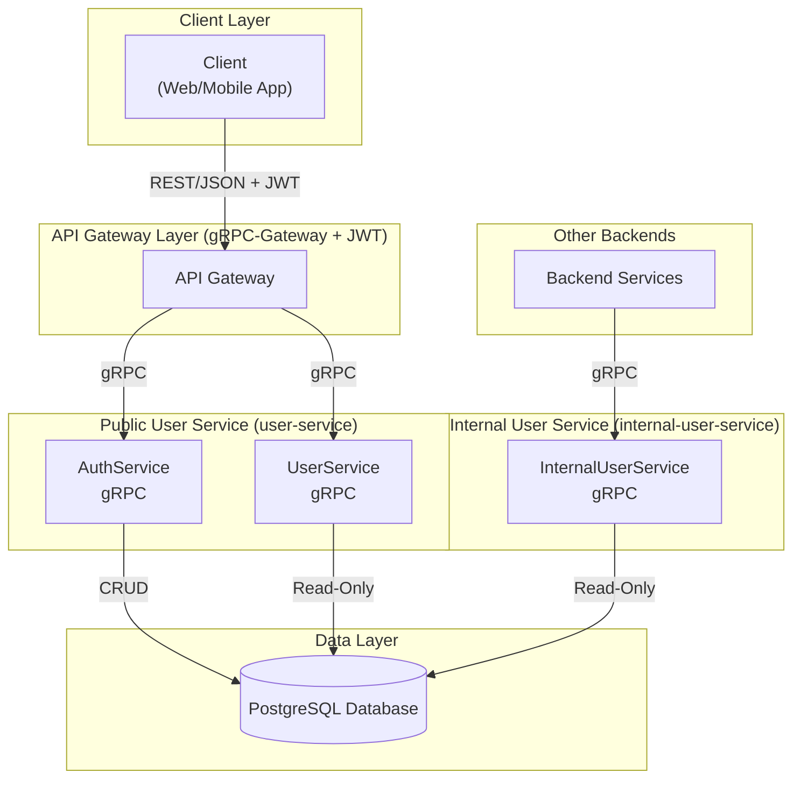

# User Service

## 1. Overview & Architecture

The user-service is a Go-based microservice responsible for user management and authentication in a microservices-based social platform. It exposes both gRPC and REST APIs (via grpc-gateway) and is designed for extensibility, security, and integration with other services.

### **Key Components**
- **UserService**: Public, read-only access to user profiles by nickname.
- **InternalUserService**: Internal-only user profile lookups by user ID (for service-to-service communication). Not exposed to external clients.
- **AuthService**: Handles registration, login, logout, and token refresh.
- **Internal Structure**: Organized into service, repository, model, middleware, security, config, logger, and tests.

### **Project Structure**

```
/user-service
|-- cmd/server/main.go         # Service entrypoint: initializes and starts gRPC/REST servers.
|-- internal/                  # All core application logic, not exposed to other services.
|   |-- config/                # Configuration loading (from YAML and env vars).
|   |-- dto/                   # Data Transfer Objects for domain and transport layers.
|   |-- errs/                  # Custom domain-specific errors.
|   |-- logger/                # Logging setup and configuration.
|   |-- mapper/                # Data mapping between protobuf, domain, and DTOs.
|   |-- middleware/            # gRPC interceptors (auth, validation, timeouts).
|   |-- model/                 # Domain models and repository interfaces.
|   |-- repository/            # Database interactions (PostgreSQL implementation).
|   |-- security/              # Password hashing and JWT generation.
|   |-- service/               # Core business logic for auth and user services.
|   |-- tests/                 # Unit and integration tests, including mocks.
|   |-- utils/                 # Utility functions (e.g., error mappers).
|-- migrations/                # SQL database migration files.
|-- config.yaml                # Default configuration for the service.
|-- Dockerfile                 # Containerization instructions.
|-- Makefile                   # Build, run, and test commands.
|-- README.md                  # This file.
```

### **Architecture Diagram**



## 2. API Reference

The service exposes three distinct gRPC services, which are also available via a RESTful JSON API.

### **AuthService**

Handles user registration, login, logout, and token management.

| Method | REST Endpoint | Description |
| :--- | :--- | :--- |
| `Register` | `POST /v1/auth/register` | Creates a new user account. |
| `Login` | `POST /v1/auth/login` | Authenticates a user and returns new tokens. |
| `Logout` | `POST /v1/auth/logout` | Invalidates a user's refresh token. |
| `RefreshToken` | `POST /v1/auth/refresh` | Issues a new token pair from a valid refresh token. |

---
#### **Example: Register a New User**
```http
POST /v1/auth/register
Content-Type: application/json

{
  "username": "new_user",
  "email": "user@example.com",
  "password": "a-very-secure-password",
  "nickname": "newbie",
  "bio": "Just joined!",
  "avatar_url": "https://example.com/avatar.png"
}
```
---

### **UserService**

Provides public, read-only access to user profiles.

| Method | REST Endpoint | Description |
| :--- | :--- | :--- |
| `FetchUserProfileByNickname` | `GET /v1/users/{nickname}` | Retrieves a public user profile by its unique nickname. |

---
#### **Example: Fetch a User Profile**
```http
GET /v1/users/newbie
Authorization: Bearer <your-jwt-access-token>
```
---

### **InternalUserService**

Provides internal-only, service-to-service access to user profiles. **This service is not exposed via the public API gateway.**

| Method | REST Endpoint (Internal Only) | Description |
| :--- | :--- | :--- |
| `FetchUserProfileByID` | `GET /v1/domain/users/{user_id}` | Retrieves a user profile by its unique numeric ID. |

## 3. Authentication

-   **JWT Authentication**: All endpoints, except for `Login` and `Register`, are protected and require a valid JSON Web Token (JWT).
-   **Middleware**: The `UnaryAuthInterceptor` validates the JWT provided in the `Authorization: Bearer <token>` header.
-   **Password Hashing**: Passwords are hashed using the **Bcrypt** algorithm.

## 4. Database Schema

### Table: `users`
| Field | Type | Constraints | Description |
| :--- | :--- | :--- | :--- |
| `id` | `BIGSERIAL` | `PRIMARY KEY` | Unique user identifier. |
| `nickname` | `VARCHAR(32)` | `NOT NULL, UNIQUE` | Unique, user-chosen nickname. |
| `username` | `VARCHAR(64)` | `NOT NULL` | The user's display name. |
| `email` | `VARCHAR(255)` | `NOT NULL, UNIQUE` | The user's email address. |
| `password_hash` | `VARCHAR(100)`| `NOT NULL` | Hashed password. |
| `bio` | `TEXT` | | A short user biography. |
| `avatar_url` | `TEXT` | | URL to an avatar image. |
| `last_login_at` | `TIMESTAMP` | `DEFAULT NOW()` | Timestamp of the last login. |
| `created_at` | `TIMESTAMP` | `NOT NULL, DEFAULT NOW()` | Timestamp of account creation. |
| `updated_at` | `TIMESTAMP` | `DEFAULT NOW()` | Timestamp of the last profile update. |

### Table: `refresh_tokens`
| Field | Type | Constraints | Description |
| :--- | :--- | :--- | :--- |
| `token` | `TEXT` | `PRIMARY KEY` | The refresh token value. |
| `user_id` | `BIGINT` | `NOT NULL, FK to users.id` | The associated user. |
| `expires_at` | `TIMESTAMP`| `NOT NULL` | The token's expiration timestamp. |

## 5. How to Run

### **Setup**

1.  **Clone the repository and its submodules:**
    ```sh
    git clone https://github.com/googleapis/googleapis.git api/proto/third_party/googleapis
    ```

2.  **Set up environment variables:**
    Create a `.env` file in the `user-service` directory with the following content:
    ```env
    # .env
    DB_HOST=localhost
    DB_PORT=5432
    DB_USER=your_db_user
    DB_PASSWORD=your_db_password
    DB_NAME=user_service_db
    JWT_SECRET_KEY=a-very-strong-and-secret-key
    JWT_EXPIRES_IN_MINUTES=60
    ```

### **Running the Service**

1.  **Start the database:**
    ```sh
    docker-compose up -d postgres
    ```

2.  **Apply database migrations:**
    ```sh
    make migrate-up
    ```

3.  **Run the service:**
    ```sh
    make run
    ```

### **Makefile Commands**
-   `make run`: Starts the Go service.
-   `make build`: Compiles the application binary.
-   `make test`: Runs all unit and integration tests.
-   `make fmt`: Formats the Go code.
-   `make migrate-up`: Applies all pending database migrations.
-   `make migrate-down`: Rolls back the last applied migration.
-   `make migrate-create name=<migration_name>`: Creates a new migration file.
