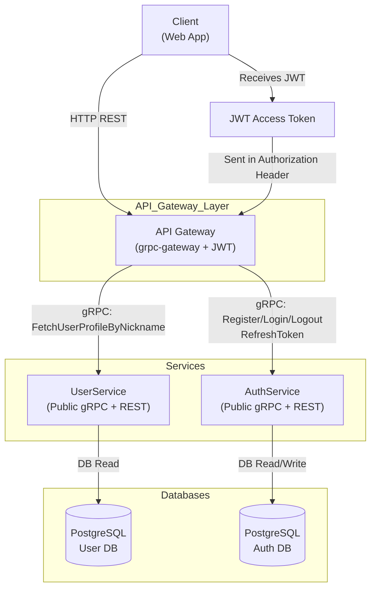

# User Service – Comprehensive Documentation

---

## Setup Requirements

Before generating code, run:

```sh
git clone https://github.com/googleapis/googleapis.git api/proto/third_party/googleapis
```

---

## 1. Overview & Architecture

The **user-service** is a Go-based microservice responsible for user management and authentication in a microservices-based social platform. It exposes both gRPC and REST APIs (via grpc-gateway) and is designed for extensibility, security, and integration with other services.

### **Key Components**
- **UserService**: Public, read-only access to user profiles by nickname.
- **AuthService**: Handles registration, login, logout, and token refresh.
- **Internal Structure**: Organized into service, repository, model, middleware, security, config, logger, and tests.

### **Architecture Diagram**


---

## 2. gRPC & REST APIs

### **UserService** (Public Read-Only)

#### Service Definition
```proto
service UserService {
  rpc FetchUserProfileByNickname (FetchUserProfileByNicknameRequest) returns (FetchUserProfileByNicknameResponse) {
    option (google.api.http) = {
      get: "/user/{nickname}"
    };
  }
}
```

#### RPC: FetchUserProfileByNickname
- **Purpose:** Retrieve a public user profile by unique nickname
- **REST Mapping:** `GET /user/{nickname}`
- **Input:**
  ```proto
  message FetchUserProfileByNicknameRequest {
    string nickname = 1;
  }
  ```
- **Output:**
  ```proto
  message FetchUserProfileByNicknameResponse {
    UserProfile user = 1;
  }
  message UserProfile {
    int64 id = 1;
    string user_name = 2;
    string email = 3;
    string nickname = 4;
    string bio = 5;
    string avatar_url = 6;
    google.protobuf.Timestamp last_login = 7;
    google.protobuf.Timestamp created_at = 8;
    google.protobuf.Timestamp updated_at = 9;
  }
  ```
- **Example REST Call:**
  ```http
  GET /user/john_doe
  Authorization: Bearer <jwt_token>
  ```

---

### **AuthService** (Authentication & Token Management)

#### Service Definition
```proto
service AuthService {
  rpc Register (RegisterRequest) returns (AuthTokenResponse) {
    option (google.api.http) = {
      post: "/auth/register"
      body: "*"
    };
  }
  rpc Login (LoginRequest) returns (AuthTokenResponse) {
    option (google.api.http) = {
      post: "/auth/login"
      body: "*"
    };
  }
  rpc Logout(RefreshTokenPayload) returns (LogoutResponse) {
    option (google.api.http) = {
      post: "/auth/logout"
      body: "*"
    };
  }
  rpc RefreshToken(RefreshTokenPayload) returns (AuthTokenResponse) {
    option (google.api.http) = {
      post: "/auth/refresh"
      body: "*"
    };
  }
}
```

#### RPC: Register
- **Purpose:** Register a new user and return access + refresh tokens
- **REST Mapping:** `POST /auth/register`
- **Input:**
  ```proto
  message RegisterRequest {
    string user_name = 1;
    string email = 2;
    string password = 3;
    string nickname = 4;
    string bio = 5;
    string avatar_url = 6;
  }
  ```
- **Output:**
  ```proto
  message AuthTokenResponse {
    string access_token = 1;
    string refresh_token = 2;
  }
  ```
- **Example REST Call:**
  ```http
  POST /auth/register
  Content-Type: application/json

  {
    "user_name": "John Doe",
    "email": "john@example.com",
    "password": "password123",
    "nickname": "johnny",
    "bio": "Hello!",
    "avatar_url": "https://cdn.example.com/avatar.jpg"
  }
  ```

#### RPC: Login
- **Purpose:** Authenticate a user and return access + refresh tokens
- **REST Mapping:** `POST /auth/login`
- **Input:**
  ```proto
  message LoginRequest {
    string email = 1;
    string password = 2;
  }
  ```
- **Output:**
  ```proto
  message AuthTokenResponse {
    string access_token = 1;
    string refresh_token = 2;
  }
  ```
- **Example REST Call:**
  ```http
  POST /auth/login
  Content-Type: application/json

  {
    "email": "john@example.com",
    "password": "password123"
  }
  ```

#### RPC: Logout
- **Purpose:** Invalidate a refresh token (logout)
- **REST Mapping:** `POST /auth/logout`
- **Input:**
  ```proto
  message RefreshTokenPayload {
    string refresh_token = 1;
  }
  ```
- **Output:**
  ```proto
  message LogoutResponse {
    string message = 1;
  }
  ```
- **Example REST Call:**
  ```http
  POST /auth/logout
  Content-Type: application/json

  {
    "refresh_token": "<refresh_token>"
  }
  ```

#### RPC: RefreshToken
- **Purpose:** Issue new tokens from a valid refresh token
- **REST Mapping:** `POST /auth/refresh`
- **Input:**
  ```proto
  message RefreshTokenPayload {
    string refresh_token = 1;
  }
  ```
- **Output:**
  ```proto
  message AuthTokenResponse {
    string access_token = 1;
    string refresh_token = 2;
  }
  ```
- **Example REST Call:**
  ```http
  POST /auth/refresh
  Content-Type: application/json

  {
    "refresh_token": "<refresh_token>"
  }
  ```

---

## 3. Authentication & Authorization
- **JWT Authentication**: Enforced for all endpoints except registration and login.
- **Middleware**: `UnaryAuthInterceptor` validates JWT from `Authorization: Bearer <token>` header.
- **Claims**: `sub` (user ID), `nickname`, `exp` (expiry)
- **Password Hashing**: Bcrypt
- **Token Generation**: HMAC-SHA256 for JWT, random for refresh tokens
- **Public Endpoints**: Register, Login, Logout, RefreshToken
- **Protected Endpoints**: All others (e.g., profile lookup)

---

## 4. Database Schema

### Table: `users`
| Field         | Type           | Constraints         | Description                |
|---------------|----------------|---------------------|----------------------------|
| id            | BIGSERIAL      | PRIMARY KEY         | User ID                    |
| nickname      | VARCHAR(32)    | NOT NULL, UNIQUE    | Unique nickname            |
| user_name     | VARCHAR(64)    | NOT NULL            | Display name               |
| email         | VARCHAR(255)   | NOT NULL, UNIQUE    | User email                 |
| password_hash | VARCHAR(100)   | NOT NULL            | Hashed password            |
| bio           | TEXT           |                     | User bio                   |
| avatar_url    | TEXT           |                     | Avatar image URL           |
| last_login_at | TIMESTAMP      | DEFAULT NOW()       | Last login time            |
| created_at    | TIMESTAMP      | NOT NULL, DEFAULT NOW() | Creation time          |
| updated_at    | TIMESTAMP      | DEFAULT NOW()       | Last update time           |

**Indexes:**
- `UNIQUE` on `nickname` and `email`
- Index on `nickname` (`idx_users_nickname`)
- Trigger to auto-update `updated_at` on row update

### Table: `refresh_tokens`
| Field      | Type      | Constraints      | Description         |
|------------|-----------|------------------|---------------------|
| token      | TEXT      | PRIMARY KEY      | Refresh token value |
| user_id    | BIGINT    | NOT NULL         | FK to users.id      |
| expires_at | TIMESTAMP | NOT NULL         | Expiry timestamp    |

**Indexes:**
- Unique index on `token`
- Index on `user_id`

---

## 5. Internal Logic & Components

### **Services**
- `UserService`: Handles profile lookup (read-only)
- `AuthService`: Handles registration, login, logout, token refresh

### **Repositories**
- `UserRepository`: User data access
- `AuthRepository`: Auth-related user data access
- `TokenRepository`: Refresh token management

### **Middleware**
- `UnaryAuthInterceptor`: JWT validation
- `ValidationInterceptor`: Request validation
- `TimeoutInterceptor`: Per-method timeouts

### **Security**
- `JWTGenerator`: Issues and validates JWTs
- `BcryptHasher`: Hashes and verifies passwords

### **Config & Logger**
- Centralized YAML config (`config.yaml`)
- Structured logging via slog

---

## 6. Configuration & Environment

### **Key Environment Variables**
| Variable                | Description                | Example / Default         |
|-------------------------|----------------------------|--------------------------|
| `DB_HOST`               | Database host              | `localhost`              |
| `DB_PORT`               | Database port              | `5432`                   |
| `DB_USER`               | Database user              | `user`                   |
| `DB_PASSWORD`           | Database password          | `password`               |
| `DB_NAME`               | Database name              | `social_platform`        |
| `JWT_SECRET_KEY`        | JWT signing secret         | `supersecret`            |
| `JWT_EXPIRES_IN_MINUTES`| JWT expiry (minutes)       | `60`                     |

### **Config File Example (`config.yaml`)**
```yaml
env: "dev"
server:
  host: "0.0.0.0"
  port: "100"
  debug: true
grpc:
  host: "0.0.0.0"
  port: 50051
  max_concurrent_streams: 100
  keepalive:
    time: 60s
    timeout: 20s
  tls:
    enabled: true
    cert_file: "/path/to/cert.pem"
    key_file:  "/path/to/key.pem"
database:
  driver: "postgres"
  host: ${DB_HOST}
  port: ${DB_PORT}
  user: ${DB_USER}
  password: ${DB_PASSWORD}
  name: ${DB_NAME}
  sslmode: "disable"
jwt:
  secret: ${JWT_SECRET_KEY}
  expires_in_minutes: ${JWT_EXPIRES_IN_MINUTES}
security:
  allowed_origins:
    - "http://localhost:3000"
logging:
  level: "debug"
  format: "json"
```

---

## 7. Error Handling

| Error Variable                | Message                                 | Typical Scenario / Description                |
|------------------------------|-----------------------------------------|-----------------------------------------------|
| ErrInternal                  | internal error                          | Unexpected server-side error                  |
| ErrDBFailure                 | database failure                        | Database connection/query failure             |
| ErrMissingMetadata           | missing metadata                        | gRPC metadata missing from request            |
| ErrUnexpectedSigningMethod   | unexpected JWT signing method           | JWT uses an unexpected signing algorithm      |
| ErrMissingAuthToken          | authorization token is not supplied     | No JWT token provided in request              |
| ErrInvalidToken              | invalid token                           | JWT is invalid, expired, or malformed         |
| ErrTokenSigningFailed        | jwt signing failed                      | Failed to sign JWT during token generation    |
| ErrTokenNotFound             | token not found                         | Refresh token not found in DB                 |
| ErrUserNotFound              | user not found                          | User does not exist in DB                     |
| ErrEmailTaken                | email already taken                     | Registration: email already exists            |
| ErrNicknameTaken             | nickname already taken                  | Registration: nickname already exists         |
| ErrInvalidPassword           | invalid password                        | Password does not match or is invalid         |
| ErrHashingFailed             | hashing failed                          | Password hashing failed                       |
| ErrInvalidArgument           | invalid argument                        | Invalid input data (validation failed)        |

**Standard Error Format (JSON/REST):**
```json
{
  "code": 404,
  "message": "user not found"
}
```

**gRPC Error Example:**
```json
{
  "code": 5,
  "message": "user not found"
}
```

---

## 8. Deployment & Operations

### **Build & Run**
- **Build:** `make build`
- **Run:** `make run`
- **Test:** `make test`
- **Format:** `make fmt`

### **Database Migrations**
- **Create migration:** `make migrate-create name=add_table`
- **Apply migrations:** `make migrate-up`
- **Rollback:** `make migrate-down`

### **Entrypoint**
- `cmd/server/main.go` initializes config, logger, DB, repositories, services, and starts both gRPC and REST servers.

### **Docker**
- *(Dockerfile is present but empty; add build/run instructions as needed)*

---

## 9. Testing
- Unit and integration tests in `internal/tests/`
- Mocks for repositories and services
- Test data for consistent test runs
